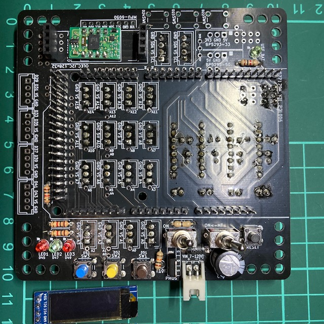
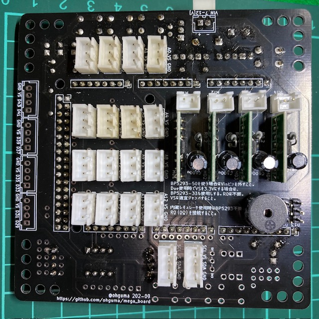
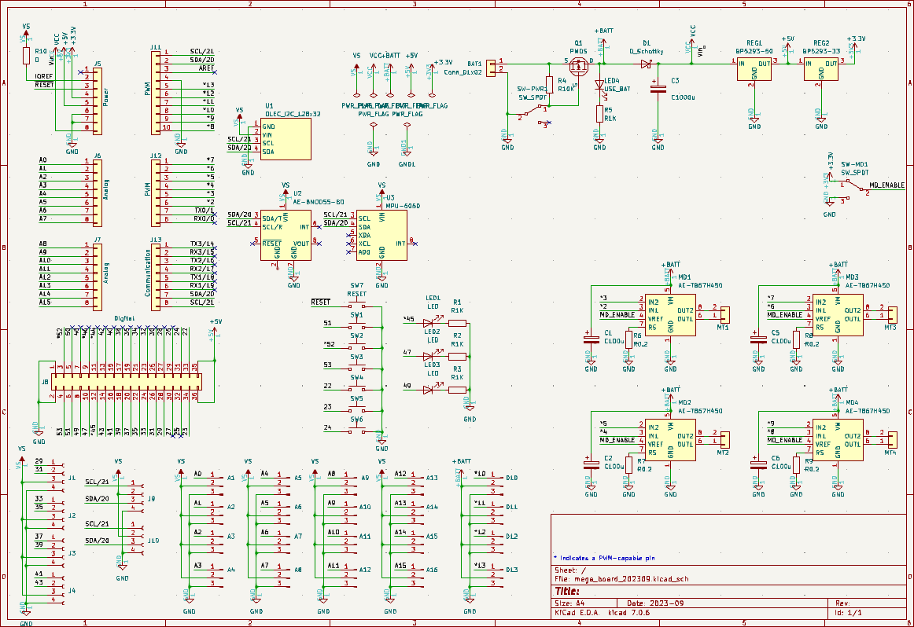

# Arduino Mega 拡張基板 2023年版

## 概要

+ Arduino Mega をXHコネクタで使うための基板の2023年版。
  + [旧版はこちら](https://github.com/ohguma/mega_board/)
  + 旧版との違い。
    + Mega, Due で利用可能。
    + センサポート電圧は内蔵レギュレータを使う場合は IOREF（Mega の場合は 5V、Due の場合は 3.3V）になる。
    + 外部レギュレータへの切り替えもできる。
    + スイッチ用パターン追加（3個 D51,D52,D53 → 6個 D22,D23,D24,D51,D52,D53）INPUT_PULLUPで利用する。
    + サーボ用端子（D10～13）電源をバッテリー直結。
+ 下記の利用も可能。
  + 4ピンXHで［D29,D31］［D33,D35］［D37,D39］［D41,D43］
  + 他のデジタルピンもビアから接続可能。
  + 3つのLED（D45,D47,D49）　HIGHで点灯。
  + 複数のI2C端子
    + TJ3B互換［SCL,5V,SDA,GND］を2ポート
    + MPU6050用
    + [AE-BNO055-BO](https://akizukidenshi.com/catalog/g/gK-16996)
    + OLED(128x32)
+ モータードライバTB67H450FNGを最大４個搭載可能。
  + [TB67H450FNG日本語データシート](https://toshiba.semicon-storage.com/info/TB67H450FNG_datasheet_ja_20201126.pdf?did=65345&prodName=TB67H450FNG)
  + 1ch：D2,D3　2ch：D4,D5　3ch：D6,D7　4ch：D8,D9
+ 基板サイズ　98 x 98mm、周囲の穴は3.2mm径、5mm間隔
  + [タミヤ ユニバーサルプレート](https://www.tamiya.com/japan/products/70172/index.html)上に取り付け可能。
  
----
## サンプルなど

旧版も基本そのまま使えるはず。
+ [旧版サンプル](https://github.com/ohguma/mega_board/tree/main/sample/)  
+ [旧版課題](https://github.com/ohguma/mega_board/tree/main/lesson)

## マニュアル
+ [Arduino Mega 基板 2023年版マニュアル](./documents/robot_arduino_mega202210_AE-TB67H450_manual.pdf) 2022-10

## 実装例

----
### パーツリスト

個数は明記なければ1個。

+ Arduino Mega2560 R3　もしくは　Arduino Due　もしくはそれらの互換機
+ ピンヘッダ
  - 1x8　5個
  - 1x10　10個
  - 2x18　18個
  - 1x3　最大4個。サーボ使用時
+ 入出力 
  - LED45,47,49用3mmLED
  - 上記LED用電流制限抵抗 1KΩ（茶黒赤金　Vf=2[V]3mA想定）
  - タクトスイッチ　制御用　最大6個
  - タクトスイッチ　リセット用　1個
  - （任意）[秋月　ＢＮＯ０５５使用　９軸センサーフュージョンモジュールキット AE-BNO055-BO](https://akizukidenshi.com/catalog/g/gK-16996)
    - VIN、GND、SDA/T、SCL/Rを接続する。
  - （任意）ジャイロセンサMPU-6050
    - amazon などでMPU6050(GY-521)として売られているもの。
    - VCC、GND、SCL、SDAの4ピンを接続する。 
    - GY-BNO055なども接続できる。
  - （任意）OLED 128x32 I2C
    - Adafruit SSD1306 ライブラリを利用する。

+ モータードライバ関係　最大4セット
  - [秋月　ＴＢ６７Ｈ４５０モータドライバモジュール AE-TB67H450](https://akizukidenshi.com/catalog/g/gK-14753/)
    - [マルツ　ブラシ付きDCモータードライバーIC DIP化基板(TB67H450FNG)](https://www.marutsu.co.jp/pc/i/1559301/)も同じピン配置なので利用できると思われる。
  - [金属皮膜抵抗 1W 0.2Ω](https://akizukidenshi.com/catalog/g/gR-08799/)　　電流制限用。抵抗値の選定はTB67H450FNGデータシート参照のこと。
  - 電解コンデンサ 50V 100uF
+ 電源関連 各1個
  - 基板用トグルスイッチ（下記FETのON/OFF用）
  - モータードライバ用トグルスイッチ（TB67H450FNGのVREFに接続。ON時は3.3V、OFF時はGNDに接続）
  - PchパワーMOSFET（30V40A MTP4835I3等）
  - 抵抗 10KΩ（茶黒橙金）
  - 0Ω抵抗。内蔵レギュレータ使用時二接続。
  - ショットキーダイオード （40V1A 1S4など。レギュレータからの逆接防止用）
  - 電解コンデンサ 10V 1000uF等（モーター動作時などの電圧降下対策用。耐圧は利用電源に合わせること）
  - 電源ON表示用3mmLED
  - 上記LED用電流制限抵抗 1KΩ（茶黒赤金　Vf=2[V]想定で3mA）
+ センサ系電源まわり（内蔵レギュレータ不使用時）
  - 5Vレギュレータ（5V1A [TA4805S](https://akizukidenshi.com/catalog/g/gI-00537/)等）　※3.3Vレギュレータ入力は5V使用。
  - 3.3Vレギュレータ（5V1A [TA48033S](https://akizukidenshi.com/catalog/g/gI-00534/)等）
 
## 購入先

+ パーツは[秋月電子](https://akizukidenshi.com/catalog/)で概ね揃う。
+ 2024年1月11日時点、Due は[アスクル](https://www.askul.co.jp/p/PU81727/)が安い。（ピンヘッダありで4,446円）

----
## 回路図

- モータードライバ周りはアプリケーションノートに従った。
  - [TB67H450FNGアプリケーションノート](https://akizukidenshi.com/download/ds/toshiba/TB67H450FNG_application_note_ja_20190510.pdf)
  - 旧版ではモータードライバごとにセラミックコンデンサ0.1uFを2個づつ接続していたが、AE-TB67H450上で実装済みだったため、今回はを省略した。
- Mega, Due の内蔵レギュレータからセンサポートに電源供給する場合、メインスイッチ横の0Ω抵抗を接続する。そうすることで、センサポート電源が IOREF に接続され、Mega の場合は5V、Dueの場合は3.3Vが供給される。
- 内蔵レギュレータを使用しない場合は0Ω抵抗は接続せず、センサポート電源を5Vにする場合は「BP5293-50」の箇所に5Vレギュレータを、3.3Vにする場合は追加で「BP5293-33」の箇所に3.3Vレギュレータも接続し、同じ箇所にある「3V3 - () - 5V」の箇所をジャンパする。
  - 秋月電子で扱いのある「[BJP5293-50](https://akizukidenshi.com/catalog/g/gM-11188/)」「[BJP5293-33](https://akizukidenshi.com/catalog/g/gM-11187/)」は入力電圧が7V以上のため、本基板では使用に適さない。
  - 代わりに低損失レギュレータを使用すること。その入出力にコンデンサを接続する際は裏面等に適宜接続する。（代替候補：「[TA4805S](https://akizukidenshi.com/catalog/g/gI-00537/)」「[TA48033S](https://akizukidenshi.com/catalog/g/gI-00534/)」）

----
## 基板作成

+ [KiCAD7](https://www.kicad.org/)で設計し、基板作成まで行った。
  + コネクタは表・裏どちらにも実装し易いよう、フットプリントで両面にシルクを入れた。
  + 参考書　 「[KiCad 7 入門実習テキスト『KiCad Basics for 7.0』（ダウンロード商品）](https://booth.pm/ja/items/4560998)」
+ 基板作成は「[JLCPCB](https://jlcpcb.com/)」を利用した。
  + つや消し黒が安い。
  + 2023-10-06発注、2023-10-14到着運。送便はOCS Expressを選択
  + twitter https://twitter.com/JLCPCB_Japan
+ [発注時ガーバーファイル](./pcb/mega_board_202309.zip)

----
## 3Dプリントデータ
+ [Arduino Mega 底面ホルダ](./cad/mega_bottom.stl)　※ホルダが付属しない互換機などでの利用を想定。

----

2024-01-11 ohguma 初版